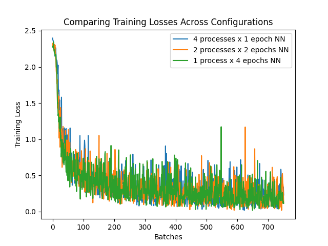

### COMS-6998: Pract DL Sys Perf Final Project:
# Cost Effective Training for Casual Practitioners

**Group:** Ali Al-keldi and Conor Flanagan  
**Slide Deck:** [Google Drive](https://docs.google.com/presentation/d/1RB412bl672gIyrJXVMs1iijhJa7x8duf3cUQWq8UoHw/edit#slide=id.p)

## Summary
Deep learning can be time consuming and cost prohibitive for individuals. Can we effectively reduce training time on personal machines with minimal code change?

Approach: Experiment with different parallel training methods on individual machines and compare results. See Slide Deck for further details.

## References
- Parameter Servers (With Distributed Autograd)
    - https://www.cs.cmu.edu/~muli/file/ps.pdf 
    - https://pytorch.org/tutorials/intermediate/rpc_param_server_tutorial.html 
- Hogwild!
    - https://arxiv.org/pdf/1106.5730.pdf
    - https://github.com/pytorch/examples/blob/main/mnist_hogwild/main.py 
- Multiprocessing
    - https://docs.python.org/3/library/multiprocessing.html 
- Shared Memory
    - https://docs.python.org/3/library/multiprocessing.shared_memory.html 
    - https://docs.python.org/3/library/multiprocessing.html#multiprocessing.Manager 
- Apple Silicon Unified Memory
    - https://www.macobserver.com/analysis/understanding-apples-unified-memory-architecture/


## Approach 2: Parameter Server
Our Parameter Server code can be found in `parameter_server/parameter_server.py`.

We based our implementation on of [this](https://pytorch.org/tutorials/intermediate/rpc_param_server_tutorial.html) pytorch reference. As was noted, we found that between the locking requirements on the parameter server, along with the additional overhead of communicated through RPC, this strategy was not successful. See `UPDATE LOCK NOTE` in `parameter_server.py` for more info on exactly where the lock in necessary, and/or to experiment with removing the lock to reproduce:

```
RuntimeError: Error on Node 0: one of the variables needed for gradient computation has been modified by an inplace operation.
```

The main function is:

```
def launch_ps_and_workers(
        world_size,
        epochs_per_worker,
        num_gpus,
        train_dataloader,
        test_dataloader): {...}
```
`launch_ps_and_workers` launches 1 parameter server, `(world_size - 1)` workers, trains on the provided data, and logs test accuracy.

## Parameter Server end-to-end example
For an end-to-end example, run `parameter_server/parameter_server_example.py`:
```
python parameter_server/parameter_server_example.py
```

In this file, we consider 2 versions of the same model and are able to see that the effects of splitting training across a parameter server are fairly low. Specifically, we consider:

1. 1 worker training 4 epochs
2. 4 workers training 1 epoch each

We call `launch_ps_and_workers` for each configuration, then print the training times. For example:

```
Elapsed time model 1: 197.349024625
Elapsed time model 2: 188.517587833
```

## Approach 3: Hogwild!
Our Hogwild! code can be found in `hogwild/hogwild.py`. The code enables easy experimenting with different models/data, as well as different configurations of how to distribute work across one or more workers/processes.

The main function are:

```
def train_model(
        model,
        train_dataloader,
        num_processes,
        epochs_per_process,
        optimizer,
        device='cpu',
        log_interval=10,  # -1 for no logs
        loss_tracker=None,
        seed=42): {...}
```
`train_model` completes the entire training process, logs accuracy on test data, and returns accumulated training losses.
```
def log_elapsed_time(
    num_processes,
    epochs_per_process,
    start,
    end): {...}
```
`log_elapsed_time` is a small helper function to log how long it took to train a particular model.

```
def chart_losses(
    losses_dict,
    title='Comparing Training Losses Across Configurations'): {...}
```
`chart_losses` takes a dictionary where the keys are model labels (ex: '4 processes x 1 epoch NN') and the value are a list of accumlated loss values and generates a chart displaying the data. Optionally, a `title` can be provided.

Example:



## Hogwild! end-to-end example
For an end-to-end example, run `hogwild/hogwild_example.py`:
```
python hogwild/hogwild_example.py
```

In this file, we consider 3 versions of the same model:
1. 1 process, 4 epochs
2. 4 processes, 1 epoch (each)
3. 2 processes, 2 epochs (each)

We use `train_model` 3 times to train each model and evaluate their test accuracies, print their elapsed times with `log_elapsed_time`, and then chart their training losses across batches with `chart_losses`. The example chart above was generated by running `hogwild_example.py`.
